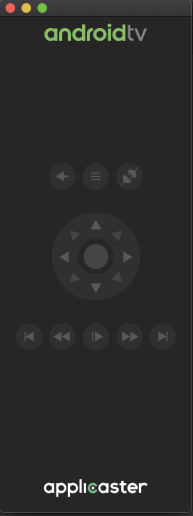

# ADB-remote for Android TV
### Remote controller for any Android TV device connected via ADB.

### Why to use ADB-remote
- standard android emulator remote covers loads of AndroidTV emulator

- it has build in `adb reverse tcp:8081 tcp:8081` - very useful for react native developers
- it has diagonal arrow
- it has next and prev for testing players
- it connects to real device via adb, so keys not supported by device can be tested

### Compiling remote adb require:
- Mac OS v. `10.15 Catalina` is expected to release around Monday 23 September 2019, until then there is beta version,
- XCode 11,
- adb located in `~/Library/Android/sdk/platform-tools/adb` if your path to adb is different please change it in `Utils.swift` class.
- there can be only one instance of connected adb device

### Roadmap:
- shoortcuts
- tooltips on mouse over
